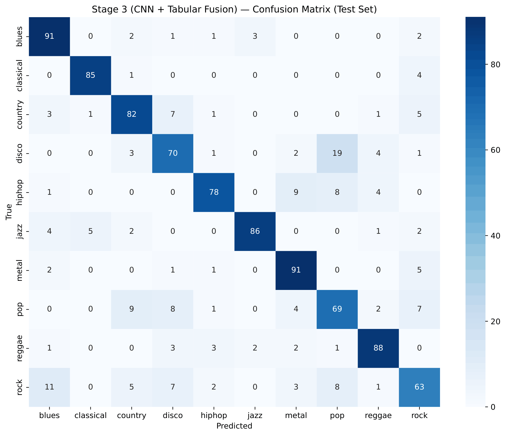
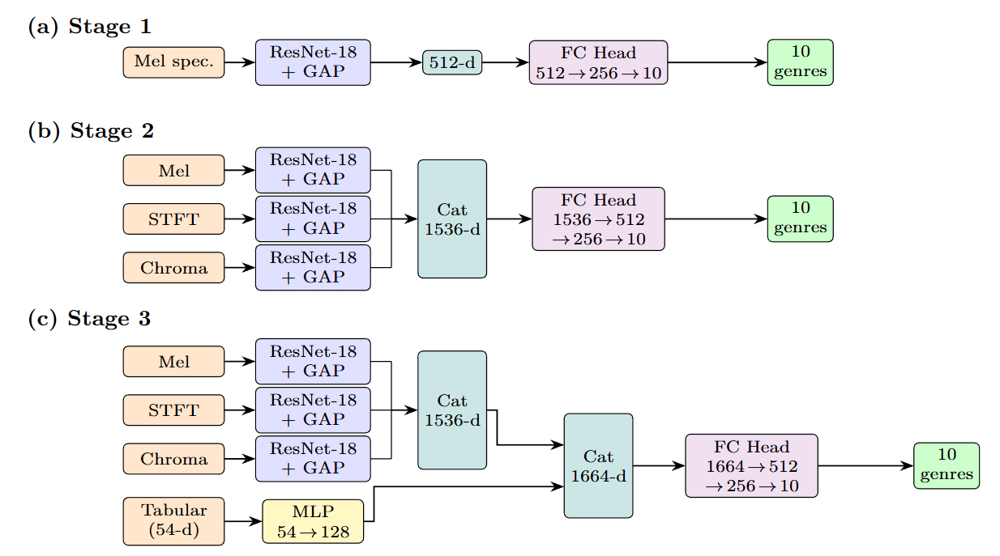
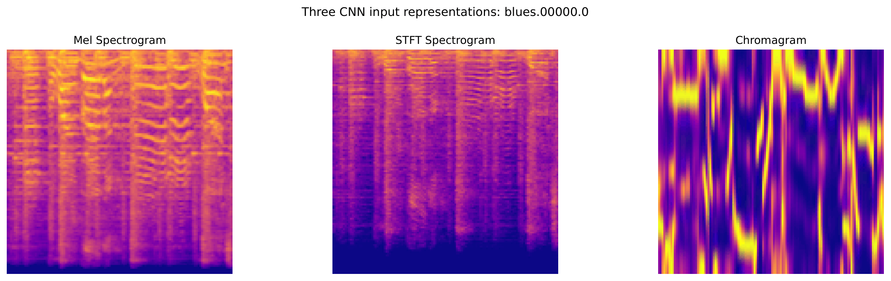

# Multimodal Music Genre Classification on GTZAN

Music genre classification on the [GTZAN](https://www.kaggle.com/datasets/andradaolteanu/gtzan-dataset-music-genre-classification/data) dataset using progressively richer multi-branch CNN architectures. Three model stages are built and compared, each fusing additional acoustic modalities to test whether complementary representations provide additive discriminative signal.

> **Final result:** 81.11% top-1 accuracy on a strictly track-split test set, up from 75.96% for a single-modality mel-spectrogram baseline.

Full write-up available in [report/multimodal-music-genre-classifier.pdf](report/multimodal-music-genre-classifier.pdf). Trained checkpoints for all three stages, generated spectrograms, and processed tabular splits are mirrored on [Hugging Face](https://huggingface.co/datasets/tristantanjh/gtzan-multi-cnn) for fast reuse: see [Reproducing](#reproducing).

## Results

| Stage | Architecture | Test Accuracy |
|-------|--------------|---------------:|
| Stage 1 | Single-branch ResNet-18 on mel spectrograms | 75.96% |
| Stage 2 | Three-branch CNN fusion (mel + STFT + chroma) | 78.79% |
| Stage 3 | Three-branch CNN fusion + tabular MLP (54 MIR features) | **81.11%** |

Each stage adds a strictly hypothesis-driven component, and each component yields a consistent improvement: +2.83 pp from adding STFT and chroma branches, then a further +2.32 pp from fusing hand-crafted MIR statistics.

### Per-genre breakdown (Stage 3)

| Genre | Precision | Recall | F1 |
|-------|----------:|-------:|---:|
| Blues | 0.81 | 0.91 | 0.85 |
| Classical | 0.93 | 0.94 | **0.94** |
| Country | 0.79 | 0.82 | 0.80 |
| Disco | 0.72 | 0.70 | 0.71 |
| Hip-hop | 0.89 | 0.78 | 0.83 |
| Jazz | 0.95 | 0.86 | **0.90** |
| Metal | 0.82 | 0.91 | 0.86 |
| Pop | 0.66 | 0.69 | 0.67 |
| Reggae | 0.87 | 0.88 | 0.88 |
| Rock | 0.71 | 0.63 | 0.67 |
| **Macro avg** | **0.81** | **0.81** | **0.81** |

<p align="center">
  
</p>

## Architecture

<p align="center">
  
</p>

Three CNN stages share a ResNet-18 backbone (ImageNet-pretrained, progressively unfrozen) and a common training protocol:

- **Stage 1.** Mel spectrogram → ResNet-18 → GAP (512-d) → FC head (512 → 256 → 10).
- **Stage 2.** Three parallel ResNet-18 branches process mel, STFT and chromagram representations. The three 512-d embeddings are concatenated (1536-d) and fed to a shared fusion head (1536 → 512 → 256 → 10).
- **Stage 3.** Adds a fourth branch — a two-layer MLP (54 → 128) over hand-crafted MIR features (MFCCs, spectral centroid/rolloff/bandwidth, ZCR, RMS, tempo). The 128-d tabular embedding is concatenated directly with the 1536-d CNN embedding (1664-d total) before the FC head, so the head learns the optimal joint compression of both modalities.

The three modalities are chosen to be complementary, not redundant:

| Representation | Resolution | Captures |
|----------------|-----------|----------|
| **Mel spectrogram** (128 bins) | Perceptual frequency | Timbre |
| **STFT spectrogram** (1025 bins) | Linear frequency | High-frequency spectral detail discarded by mel |
| **Chromagram** (12 pitch classes) | Western chromatic scale | Harmonic / chord vocabulary |

<p align="center">
  
</p>

All representations use $N_\text{fft}=2048$, hop length $H=512$ at $f_s=22{,}050$ Hz, resized to $128\times128$ RGB plasma-colourised images, and ImageNet-normalised for compatibility with pretrained weights.

## Methodology highlights

**Track-level splitting.** The single most important decision in this project. GTZAN tracks are split into 10 × 3-second segments; a naive random split over segments leaks information across the train/test boundary because segments from the same recording are near-identical acoustically. Stratified 80/10/10 splitting is performed at the **track level** (790/99/99 tracks), and all derived data — spectrograms, tabular rows, augmentations — is assigned to the same split as the parent track. This produces a harder but methodologically sound evaluation; see the discussion of baseline leakage below.

**Offline SpecAugment-style augmentation.** Four augmentations (time masking, frequency masking, circular time shift, Gaussian noise) are applied **offline** to training segments only, expanding training data 5× to 39,455 segments. Offline rather than online so all three spectrogram modalities for a given segment receive identical masks, preserving cross-modal alignment. Augmentations are applied to the raw spectrogram array before colormap nonlinearity.

**Data cleaning.** All 1000 WAV files are integrity-checked. Twelve tracks are removed: `jazz.00054` (known to contain speech, not music), near-silent tracks (`rms_mean < 0.01`), and PCA outliers (≥ 8/10 segments more than 3σ from the genre centroid). Final dataset: 988 tracks / 9,870 segments.

**Feature de-duplication.** Three of the 57 tabular features (`rolloff_mean`, `spectral_bandwidth_mean`, `spectral_centroid_mean`) have Pearson |r| ≥ 0.93 against another retained feature and are dropped, leaving 54. `StandardScaler` is fit on training data only.

**Training protocol** (common across all stages): Adam optimiser, cross-entropy loss, StepLR scheduler (γ = 0.5 every 10 epochs), early stopping on validation loss (patience 7), and best-validation-accuracy weight restoration. Layers 1–3 of ResNet-18 are frozen for 4 epochs (head-only at lr = 1e-3); `layer4` is unfrozen at epoch 5 with a reduced backbone lr = 1e-4.

## Comparison with the Kaggle baseline

The most upvoted Kaggle notebook ([Olteanu, 2020](https://www.kaggle.com/code/andradaolteanu/work-w-audio-data-visualise-classify-recommend)) reports **90.22%** with XGBoost on the tabular features — a 9.11 pp lead over Stage 3. The report argues this is partly methodological:

1. **Segment-level splitting.** The baseline calls `train_test_split` directly on the 9,990-row segment dataframe, so segments from the same track appear on both sides of the split — the model effectively memorises tracks rather than learning genre features.
2. **Pre-split feature scaling.** `MinMaxScaler.fit_transform` is called on the full dataframe before splitting, contaminating the scaler with test-set statistics.

Both leakages inflate the reported accuracy. The remaining gap reflects a real structural advantage of gradient-boosted trees on small, expert-designed feature matrices — a 988-track dataset structurally favours low-dimensional tree-based models over deep CNNs, even with transfer learning and aggressive augmentation. Directions to close the gap (audio-domain pretraining via VGGish/PANNs, track-level test-time aggregation, systematic hyperparameter search) are discussed in the report.

## Repository structure

```
multimodal-music-genre-classifier/
├── multimodal_music_genre_classification.ipynb   # End-to-end notebook (94 cells)
├── report/
│   ├── multimodal-music-genre-classifier.pdf     # Full project report
│   ├── report_shortened.tex                      # LaTeX source
│   └── references.bib
├── figures/                                       # Generated figures used in the report
│   ├── spectrogram_trio.pdf
│   ├── augmentation_examples.pdf
│   ├── pca_scatter.pdf
│   ├── correlation_heatmap.pdf
│   ├── feature_distributions.pdf
│   ├── stage{1,2,3}_curves.pdf
│   └── stage{1,2,3}_confusion.pdf
└── README.md
```

The notebook is self-contained and runs end-to-end: dataset exploration → cleaning → track-level splitting → spectrogram generation → augmentation → three model stages, each with training curves and a held-out confusion matrix.

## Reproducing

The generated spectrograms, augmented training set, processed tabular splits, and **trained model checkpoints for all three stages** are mirrored on Hugging Face:

> [huggingface.co/datasets/tristantanjh/gtzan-multi-cnn](https://huggingface.co/datasets/tristantanjh/gtzan-multi-cnn)

This is enough to skip the heavy preprocessing steps and jump straight to evaluation or fine-tuning. The raw audio source is the original [GTZAN dataset on Kaggle](https://www.kaggle.com/datasets/andradaolteanu/gtzan-dataset-music-genre-classification/data) (1000 × 30 s WAVs and the 3-second tabular features CSV).

Tested with Python 3.10, PyTorch 2.x with CUDA, `librosa`, `scikit-learn`, `pandas`, `matplotlib`. Random seed 42 is fixed for `torch` and `numpy`. The notebook runs end-to-end and regenerates all artifacts; total training time is roughly 30–60 minutes per stage on a single consumer GPU.

## License

Code, figures, and report released under the [MIT License](LICENSE). The underlying GTZAN audio is the property of its original authors (Tzanetakis & Cook, 2002) and is not redistributed here; please consult the [original Kaggle release](https://www.kaggle.com/datasets/andradaolteanu/gtzan-dataset-music-genre-classification/data) for terms of use of the dataset itself.
